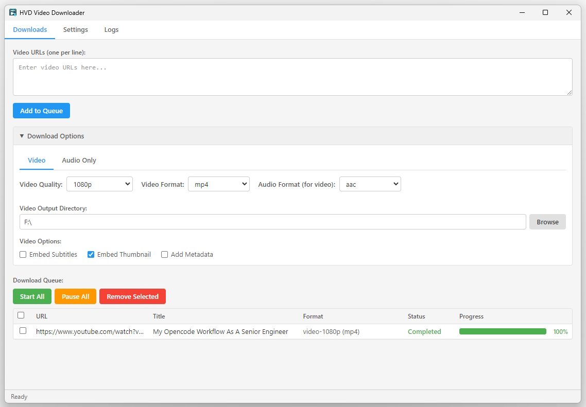

# HVD Video Downloader

A desktop GUI wrapper around [yt-dlp](https://github.com/yt-dlp/yt-dlp) for downloading
video and audio content. Built with Electron and React.



## Features

- Download video in multiple formats and quality levels
- Download audio only with format and bitrate options
- Queue multiple downloads with pause, resume, and cancel
- Embed subtitles and thumbnails
- Multi-language support (English, German, Spanish, Italian, Japanese, Portuguese)
- Light, dark, and auto (system) theme
- Built-in browser-based authentication
- Auto-check and one-click download of required tools

## Installation

Download the latest installer from the
[Releases](https://github.com/coredds/hvd2/releases) page.

On first launch the app checks for required tools and downloads them
automatically if needed.

## Development

```bash
npm install
npm run dev        # Start in development mode
npm run build      # Production build
npm run test       # Run tests
```

## Credits

HVD relies on these excellent open-source projects:

- [yt-dlp](https://github.com/yt-dlp/yt-dlp) — media downloader
- [FFmpeg](https://ffmpeg.org) — audio/video processing
- [Deno](https://deno.com) — post-processing runtime
- [Electron](https://www.electronjs.org) — desktop app framework
- [React](https://react.dev) — UI library
- [Tailwind CSS](https://tailwindcss.com) — styling
- [Vite](https://vitejs.dev) — build tooling
- [Zustand](https://github.com/pmndrs/zustand) — state management
- [i18next](https://www.i18next.com) — internationalization

## License

MIT — see [LICENSE](LICENSE) for details.

yt-dlp is provided under [The Unlicense](https://unlicense.org).
FFmpeg binaries are provided under their respective licenses.
