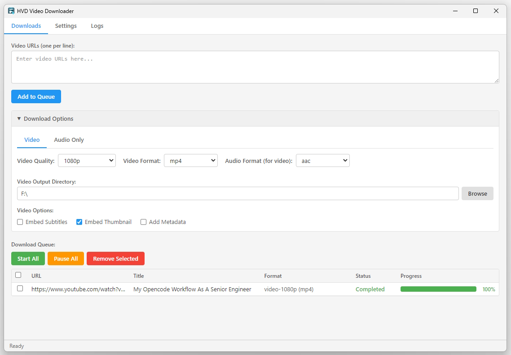

# HVD Video Downloader

A desktop GUI wrapper around [yt-dlp](https://github.com/yt-dlp/yt-dlp) for downloading
video and audio content. Built with Electron and React.



## Features

- Download video in multiple formats and quality levels
- Download audio only with format and bitrate options
- Separate output folders for video and audio downloads
- Queue multiple downloads with pause, resume, and cancel
- Embed subtitles and thumbnails
- Multi-language support (English, German, Spanish, Italian, Japanese, Portuguese)
- Light, dark, and auto (system) theme
- Browser-cookie authentication for sites that require sign-in
- Auto-check and one-click download of required tools

## Authentication

Some sites (notably YouTube) require a signed-in session to download. HVD passes
your browser's cookies to yt-dlp using `--cookies-from-browser`.

1. Sign in to the site in the browser you want HVD to use.
2. Open **Settings → Application Settings → Browser Cookies Configuration**,
   enable browser cookies, and pick the browser (defaults to Chrome).
3. Start the download.

Cookies are read from the selected browser's profile. Some browsers and profiles
(especially recent Chrome versions) lock or encrypt their cookie store. If the
cookies cannot be read, HVD retries the download without authentication. Closing
the browser before downloading often helps.

## Installation

Download the latest installer from the
[Releases](https://github.com/coredds/hvd2/releases) page.

On first launch the app checks for required tools and downloads them
automatically if needed.

## Development

```bash
npm install
npm run dev        # Start in development mode
npm run build      # Production build
npm run test       # Run tests
npm run lint       # Lint TypeScript sources
```

## Credits

HVD relies on these excellent open-source projects:

- [yt-dlp](https://github.com/yt-dlp/yt-dlp) — media downloader
- [FFmpeg](https://ffmpeg.org) — audio/video processing
- [Deno](https://deno.com) — post-processing runtime
- [Electron](https://www.electronjs.org) — desktop app framework
- [React](https://react.dev) — UI library
- [Tailwind CSS](https://tailwindcss.com) — styling
- [Vite](https://vitejs.dev) — build tooling
- [Zustand](https://github.com/pmndrs/zustand) — state management
- [i18next](https://www.i18next.com) — internationalization

## License

MIT — see [LICENSE](LICENSE) for details.

yt-dlp is provided under [The Unlicense](https://unlicense.org).
FFmpeg binaries are provided under their respective licenses.
